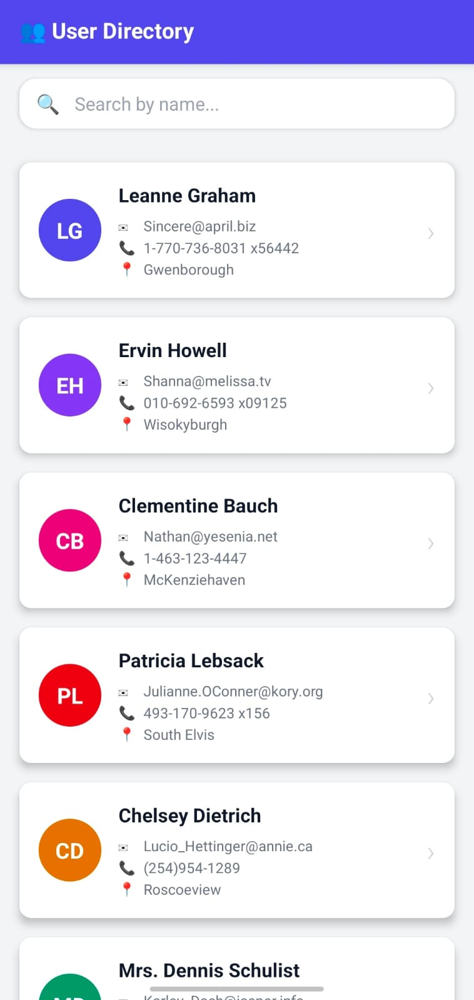
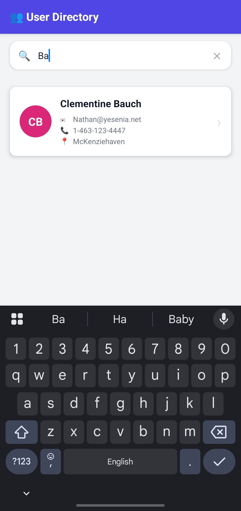
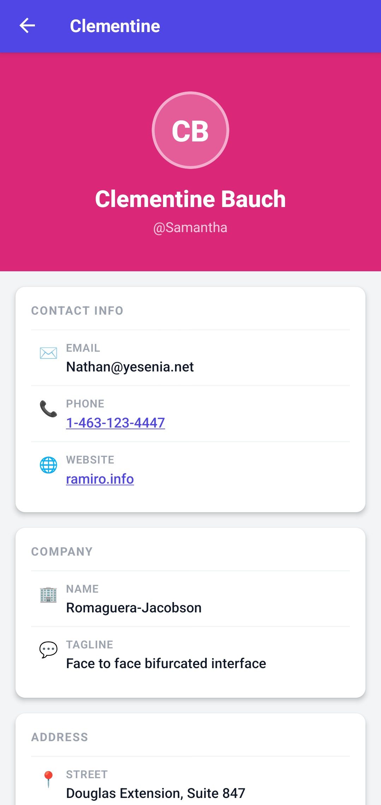
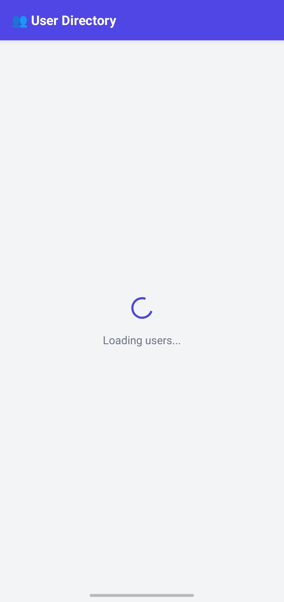

# 👥 User Directory — React Native App

A clean, production-ready React Native app built with **Expo** and **TypeScript** that fetches and displays users from a public API with search, navigation, and polished UI.

---

## 📱 Screenshots

### 🏠 Home Screen


### 🔍 Search


### 👤 User Details


### ⏳ Loading Users Screen


---

## ✨ Features

- 🔄 **Fetches users** from [JSONPlaceholder API](https://jsonplaceholder.typicode.com/users)
- 🃏 **Card-based UI** showing name, email, phone & city
- 🔍 **Live search** — filter users by name in real time
- 🧭 **Stack navigation** — tap a card to open a detail screen
- 📄 **Detail screen** shows name, email, phone, website & company
- ⏳ **Loading indicator** while data is being fetched
- ❌ **Error handling** with a retry button
- 🎨 **Color-coded avatars** unique per user
- 📞 **Tappable phone/website** links on the detail screen
- 💯 **Full TypeScript** throughout

---

## 🗂 Project Structure

```
assignment/
├── App.tsx                        # Root: navigation setup
├── src/
│   ├── types/
│   │   └── User.ts                # TypeScript interfaces
│   ├── hooks/
│   │   └── useFetchUsers.ts       # Custom fetch hook
│   ├── components/
│   │   ├── UserCard.tsx           # Card component
│   │   └── SearchBar.tsx          # Search input component
│   └── screens/
│       ├── HomeScreen.tsx         # User list + search
│       └── UserDetailScreen.tsx   # Full user profile
├── package.json
├── .gitignore
├── tsconfig.json
├── babel.config.js
└── app.json
```

---

## 🚀 Getting Started

### Prerequisites

- [Node.js](https://nodejs.org/) (v18 or higher)
- [Expo CLI](https://docs.expo.dev/get-started/installation/)
- Expo Go app on your phone ([iOS](https://apps.apple.com/app/expo-go/id982107779) / [Android](https://play.google.com/store/apps/details?id=host.exp.exponent))

### Installation

```bash
# 1. Clone the repository
git clone https://github.com/amey1355/assignment.git
cd assignment

# 2. Install dependencies
npm install

# 3. Start the Expo development server
npm start
```

### Running on a Device

After running `npm start`:

- **Physical device**: Scan the QR code with the **Expo Go** app
- **Android Emulator**: Press `a` in the terminal

---

## 🛠 Tech Stack


| Technology          | Purpose                                               |
| ------------------- | ----------------------------------------------------- |
| React Native        | Cross-platform mobile framework                       |
| Expo                | Development toolchain & build system                  |
| TypeScript          | Type-safe JavaScript                                  |
| React Navigation    | Screen navigation (native stack)                      |
| React Hooks         | State management (`useState`, `useEffect`, `useMemo`) |
| JSONPlaceholder API | Mock REST API for user data (as given)                |


---

## 📦 Key Dependencies

```json
{
    "@react-navigation/native": "^6.1.18",
    "@react-navigation/native-stack": "^6.11.0",
    "expo": "~54.0.33",
    "expo-status-bar": "~3.0.9",
    "react": "19.1.0",
    "react-native": "0.81.5",
    "react-native-safe-area-context": "~5.6.0",
    "react-native-screens": "~4.16.0"
}
```

---

## 🔌 API Reference

**Endpoint:** `GET https://jsonplaceholder.typicode.com/users`

Returns 10 mock users. Each user contains:


| Field          | Description       |
| -------------- | ----------------- |
| `name`         | Full name         |
| `username`     | Username / handle |
| `email`        | Email address     |
| `phone`        | Phone number      |
| `website`      | Personal website  |
| `address.city` | City of residence |
| `company.name` | Employer name     |


---

## 🙌 Amey Sawant

Built with ❤️ using React Native + Expo + TypeScript.

---

